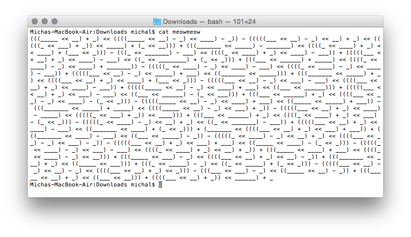

## MeowMeow 75 (misc, 75p)

### PL
[ENG](#eng-version)

Dostajemy [dziwny plik tekstowy](meowmeow) z różnymi wyrażeniami typu `((_____ << __) + _)`

Jeśli ktoś robił cokolwiek w C to pewnie rozpozna syntax tego języka.

`A << B` odpowiada przesunięciu `A` o `B` bitów w lewo, a `A + B` i `(...)` chyba nie muszę tłumaczyć :)

Tak więc za dane podkreślenie podstawiamy jego długość i [wszystko uruchamiamy](solve.py). Dostajaemy długą liczbę `0xa7d30363063346262616338356133653036663535303863343836616531653138397b53495341L`, zamieniamy ją na text i dostajemy `}060c4bbac85a3e06f5508c486ae1e189{SISA`

### ENG version

In this task, we're presented with a [weird-looking text file](meowmeow) with various expressions like `((_____ << __) + _)`

If you've done almost anything in C then you should notice that this is a valid C code.

`A << B` corresponds to left bitwise shift, I don't think I have to explain how `A + B` and `(...)` work :)

So we swap each underline with it's length and try to run [the code](solve.py). We get this quite long hex number:`0xa7d30363063346262616338356133653036663535303863343836616531653138397b53495341L`, covert it to text and you get a reversed flag `}060c4bbac85a3e06f5508c486ae1e189{SISA`
