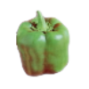
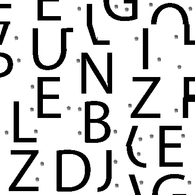
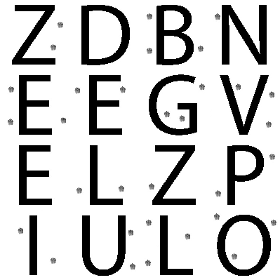

## Jigsaw (Misc)
	tl;dr Solve the jigsaw, get letter indexes from binary

We're given 64 pieces of puzzle, after taking a quick glance, we've noticed that some of them have white background and other ones black. So there are either 2 puzzles to be solved or some of the pieces have had their colors inverted. 

We've decided to go with the second option, so we've started by inverting tiles with black background and marking such pieces with a: 

Now all we have to do is solve the puzzle ;)

After some googling, we've found a [nice-looking solver](https://github.com/biswajitsc/jigsaw-solver)

Skipping some hassle with opencv, we got:

Not bad, solving the rest manually should be easy:

The peppers contain each letters index in binary (`left-up, righ-up, left-down, right-down`)

Some indexes appeared more than once, so we had to shuffle pieces from the same letters to get a unique index for each letter.
