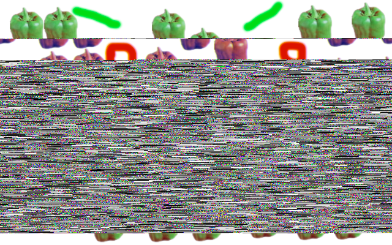

## Evil farmers (Misc, 400, 3 solves)
	tl;dr Brute-force first wep password, find second wep password, recover peppers

We start off by exporting the capture to `pcap` using wireshark, `aircrack-ng` doesn't allow `pcapng` as input.

After loading it in `aircrack-ng` and removing networks without any handshakes, captured IVS and names, we're left with:

```
#     BSSID              ESSID                     Encryption
1     C4:6E:1F:97:74:5C  FLOVIOMEL                 WPA (1 handshake)
8     C8:3A:35:50:F7:F0  ChattyOfficeInc           WEP (132219 IVs)
13    58:6D:8F:2C:C9:98  Linksys F                 WPA (1 handshake)
26    00:00:00:00:00:00  Ù                         WEP (1 IVs)
2914  CA:FF:FF:FF:FF:FF  ÿÿÿÿÿÿÿÿÿÿÿÿÿÿ?:¯@€oðN??  WEP (1 IVs)

```

`ChattyOfficeInc` looks interesting, 132k IVs should be more than enough to crack it using PTW attack.

Unfortunately, that didn't work, we had to brute-force the password, which turned out to be `lamep`

```
michal@ctf:/media/sf_Desktop$ airdecap-ng -w 6c:61:6d:65:70 look.pcap 
Total number of packets read        646333
Total number of WEP data packets    147872
Total number of WPA data packets     30161
Number of plaintext data packets        44
Number of decrypted WEP  packets     30452
Number of corrupted WEP  packets         0
Number of decrypted WPA  packets         0
```

Using a cool program [Network Miner](http://www.netresec.com/?page=NetworkMiner), we were able to quickly find a suspicious POST login:


After some investigation, we found out, that our farmer has changed the WEP password

```
Form item: "wifiEn" = "disabled"
Form item: "wpsmethod" = "pbc"
Form item: "GO" = "wireless_security.asp"
Form item: "ssidIndex" = "ChattyOfficeInc"
Form item: "security_mode" = "1"
Form item: "security_shared_mode" = "enable"
Form item: "wep_default_key" = "1"
Form item: "wep_key_1" = "keepgoingdude"
Form item: "WEP1Select" = "1"
Form item: "wep_key_2" = "ASCII"
Form item: "WEP2Select" = "1"
Form item: "wep_key_3" = "ASCII"
Form item: "WEP3Select" = "1"
Form item: "wep_key_4" = "ASCII"
Form item: "WEP4Select" = "1"
Form item: "cipher" = "aes"
Form item: "passphrase" = "12345678"
Form item: "keyRenewalInterval" = "3600"
Form item: "wpsenable" = "disabled"
Form item: "wpsMode" = "pbc"
Form item: "PIN" = ""
```

So `keepgoingdude` is the second WEP password, let's decrypt the pcap one more time

It turns out that the farmer got a little naughty ;), but that wasn't the point of the challange

We've noticed a suspicous `Internet Printing Protocol` stream with `job-name: flag.png`

After a lot of struggling to recover the PostScript file, we've managed to get a part of it:



And get the flag: `DCTF{md5("pepper")}`