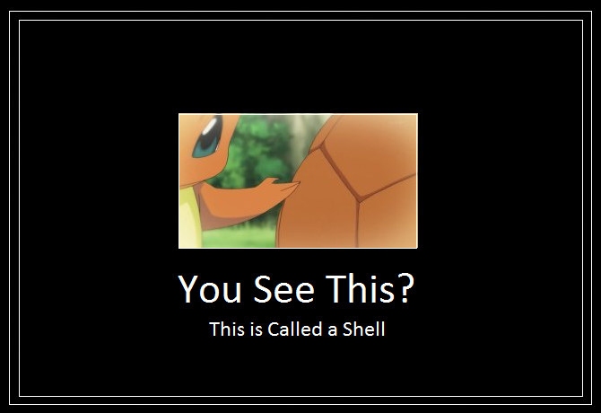

# RE 100

We've started with single x86 Windows binary `GuessWhat.exe`. In disassembly we've found few initial condtions that must have been passed to fully execute the code:

- Binary must be executed with at least one argument "TM"
- Can't be launched under debugger because of few PEB-based anti-debugger checks leading to #DE exception (divide-by-zero).

We patched off all found check-ups and executed binary under debugger. 

```
Ok, now you're in :)

V2hhdCBkbyB5b3Uga25vdyBhYm91dCBjaXBoZXJzPwo=?????

Do you have something for me?
```

Base64-encoded string evaluates to `What do you know about ciphers?`. The correct answer passed to `strcmp` call was `rc4`.

```
A7A91F1EA45AE0BE03735A09577DA594230BDE854B

Now you have the encrypted string you probably need a key, right?

Take a closer look at the string functions.
```

The key was evaluated by `sub_4011E0` subroutine, which transforms `9g>csumcsu` constant to `0x7fffffff` string.

```python
from malduck import rc4, unhex
rc4(b"0x7fffffff", unhex("A7A91F1EA45AE0BE03735A09577DA594230BDE854B"))                                                                                                                                    
b'&N0wu4rEgeTTinGth3re!'
```

`GuessWhat.exe` contains encrypted ZIP file placed as `ZIP` resource inside the binary. Key found inside the binary was password needed to extract `img.jpg` file.



So we've got a shell ¯\\_(ツ)_/¯. After steganalysis and trying various tools popular in this kind of tasks, we've found that message was hidden using Steghide with blank password.

```
$ steghide info img.jpg
"img.jpg":
  format: jpeg
  capacity: 1.6 KB
Try to get information about embedded data ? (y/n) y
Enter passphrase: 
  embedded file "shell.txt":
    size: 1.2 KB
    encrypted: rijndael-128, cbc
    compressed: yes
```

`shell.txt` contains simple x86 shellcode which loads `user32.dll!MessageBoxA` and... shows a message.

```
"\xd9\xeb\x9b\xd9\x74\x24\xf4\x31\xd2\xb2\x77\x31\xc9\x64\x8b"
"\x71\x30\x8b\x76\x0c\x8b\x76\x1c\x8b\x46\x08\x8b\x7e\x20\x8b"
"\x36\x38\x4f\x18\x75\xf3\x59\x01\xd1\xff\xe1\x60\x8b\x6c\x24"
"\x24\x8b\x45\x3c\x8b\x54\x28\x78\x01\xea\x8b\x4a\x18\x8b\x5a"
"\x20\x01\xeb\xe3\x34\x49\x8b\x34\x8b\x01\xee\x31\xff\x31\xc0"
"\xfc\xac\x84\xc0\x74\x07\xc1\xcf\x0d\x01\xc7\xeb\xf4\x3b\x7c"
"\x24\x28\x75\xe1\x8b\x5a\x24\x01\xeb\x66\x8b\x0c\x4b\x8b\x5a"
"\x1c\x01\xeb\x8b\x04\x8b\x01\xe8\x89\x44\x24\x1c\x61\xc3\xb2"
"\x08\x29\xd4\x89\xe5\x89\xc2\x68\x8e\x4e\x0e\xec\x52\xe8\x9f"
"\xff\xff\xff\x89\x45\x04\xbb\x7e\xd8\xe2\x73\x87\x1c\x24\x52"
"\xe8\x8e\xff\xff\xff\x89\x45\x08\x68\x6c\x6c\x20\x41\x68\x33"
"\x32\x2e\x64\x68\x75\x73\x65\x72\x30\xdb\x88\x5c\x24\x0a\x89"
"\xe6\x56\xff\x55\x04\x89\xc2\x50\xbb\xa8\xa2\x4d\xbc\x87\x1c"
"\x24\x52\xe8\x5f\xff\xff\xff\x68\x20\x69\x74\x58\x68\x20\x67"
"\x65\x74\x68\x6d\x6f\x73\x74\x68\x65\x20\x61\x6c\x68\x75\x20"
"\x61\x72\x68\x65\x20\x79\x6f\x68\x20\x44\x6f\x6e\x68\x57\x65"
"\x6c\x6c\x31\xdb\x88\x5c\x24\x1f\x89\xe3\x68\x58\x20\x20\x20"
"\x68\x46\x42\x5a\x7d\x68\x51\x4a\x5f\x41\x68\x5a\x7b\x41\x41"
"\x68\x4e\x47\x57\x4e\x31\xc9\x88\x4c\x24\x10\x89\xe1\x31\xd2"
"\x6a\x30\x53\x51\x52\xff\xd0\x31\xc0\x50\xff\x55\x08";
```


`NGWNZ{AAQJ_AFBZ}` is ROT-6 encrypted flag: `TMCTF{GGWP_GLHF}`.
