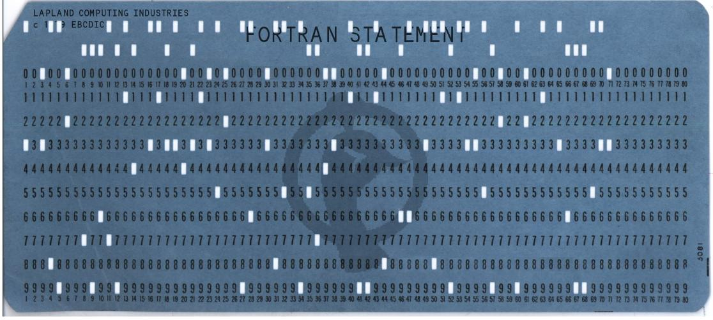

# FORMULA TRANSLATION PROFESSIONAL

> Points: 482 [500]

## Description

> Oh thank goodness you're here! Everything is on fire, the whole mainframe has gone awry! We've had a secure flag-checking program running on our new IBM for days now, but we think something might have happened that corrupted everything... Here, we have the punch cards for the malfunctioning program, and here's what the machine printed this morning, looks like everything is gibberish. Do you think you can retrieve our department's flag back, please? You would save this whole quarter.

## Solution

This was really interesting as it takes us back in time to the [punchcard programming](https://en.wikipedia.org/wiki/Computer_programming_in_the_punched_card_era) era. 

Basically we were given a folder full of punchcards as well as a FLAG.ENC file which contains some useful keys. 

The above punchcard translates to: `C THIS PROGRAM CALCULATES IF THE INPUT ARRAY OF CHARACTERS IS A CORRECT`

Damn thats a lot of paper for a short line of code. Programming must be really difficult in the past. Imagine punching all the cards for your program only to realise that there is a small bug at the end. You'll have to wait in line for your next computer time in order to run your program!

Anyways, I grabbed a [punchcard reader](https://github.com/digitaltrails/punchedcardreader/blob/master/punchedCardReader.py) from github to decode all the files in the folder, only to reveal another fortran code. At this point, I was already burnt out from reversing the previous fortran code but I followed through anyway and this was yet another painful experience.

## Flag
`ctf{}`